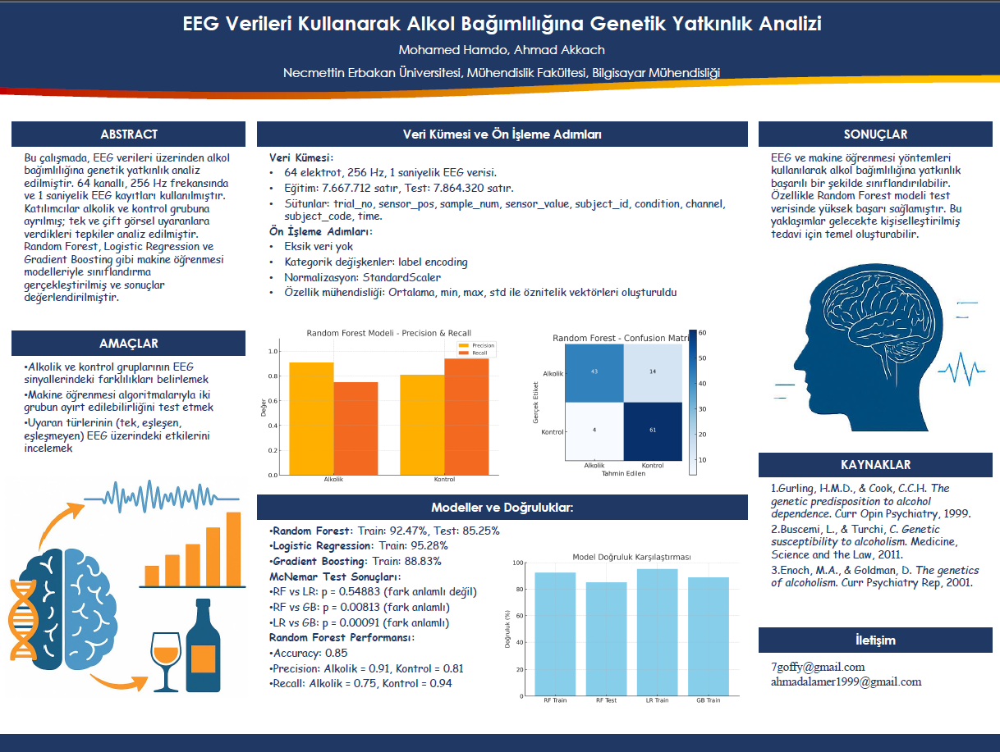

# 🧠 EEG Alcoholism Genetic Predisposition (Data Science & Machine Learning)

This project leverages **Machine Learning** techniques to analyze **EEG (Electroencephalogram)** signals and detect neurophysiological differences associated with a genetic predisposition to alcoholism.

The study aims to classify individuals into two groups (Alcoholic vs. Control) based on their brainwave patterns response to visual stimuli. By analyzing time-series data from 64 electrodes, the project identifies key features that differentiate potential genetic predisposition to addiction.

## 📊 Dataset
The data is derived from the **EEG Database** (available on UCI Machine Learning Repository / Kaggle).
* **Source:** Neurodynamics Laboratory, State University of New York Health Center.
* **Subjects:** Alcoholics and Control group.
* **Data Points:** 64 electrodes placed on the scalp, sampled at 256 Hz (3.9 msec epoch).
* **Stimuli:** Single stimulus (S1) or two stimuli (S1 and S2) in matched/non-matched conditions.

## 🛠️ Methodology & Workflow

### 1. Data Preprocessing & EDA
* **Data Cleaning:** Handling missing values and removing outliers using the IQR method.
* **Visualization:** Analyzing sensor value distributions and correlations between channels.
* **Label Encoding:** Converting categorical variables (`sensor_position`, `subject_identifier`, `matching_condition`) for model compatibility.

### 2. Feature Engineering
* Aggregated statistical features (Mean, Standard Deviation, Min, Max) were extracted for each subject and trial to transform raw time-series data into a tabular format suitable for classification.

### 3. Machine Learning Models
Three classification algorithms were implemented and compared:
* **Random Forest Classifier** (Selected as the best model)
* **Logistic Regression**
* **Gradient Boosting Classifier**

### 4. Statistical Validation
* **McNemar’s Test** was used to statistically validate the performance differences between the models, ensuring the results are significant.

## 📈 Key Results
* **Best Model:** Random Forest
* **Accuracy:** **85.25%** on the test set.
* **Key Findings:**
    * Significant differences were observed in the **occipital** and **parietal** brain regions between the two groups.
    * Alcoholic subjects showed distinct temporal patterns and lower correlation between brain regions compared to the control group.

| Model | Accuracy |
| :--- | :--- |
| **Random Forest** | **85.25%** |
| Logistic Regression | 95.28% (Train) / Lower Test |
| Gradient Boosting | 88.83% (Train) / Lower Test |

*(Note: While Logistic Regression showed high training accuracy, Random Forest provided the most robust generalization on test data).*

## 💻 Tech Stack
* **Language:** Python
* **Libraries:** Pandas, NumPy, Scikit-learn, Matplotlib, Seaborn, Tqdm, Missingno.

## 🎓 Acknowledgments
This project is supported by the **Scientific Research Projects Unit of
